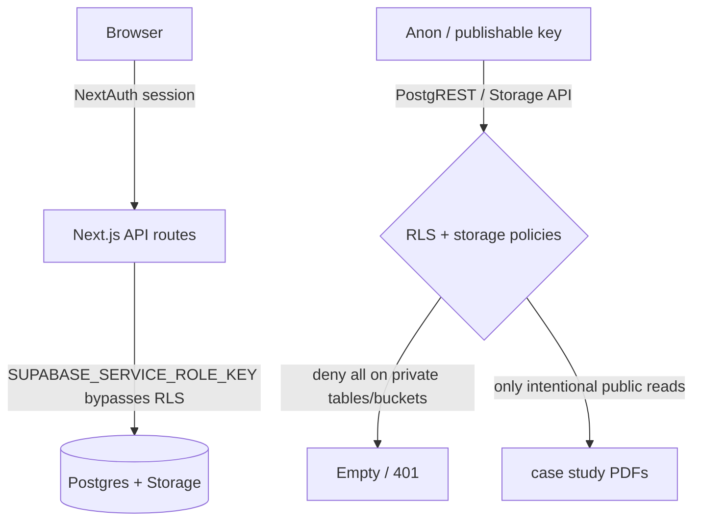

# Area 01 — Deep dive + fix plan

**Status:** implementing — SQL apply blocked (no DB password in env / MCP lacks project access)  
**Project:** `hvsoeezsbvwsrdobvgaz` (Sunday Harmony production)  
**Date of live probe:** 2026-07-14  
**Progress:** expanded migration + verify/invalidate scripts + diagnostics shipped; staff/client passwords rotated; anon tables still EXPOSED until SQL runs

---

## Why this area first

This is the foundation under every other security topic. The app trusts Next.js + the service role for all real access. The **anon key** is supposed to be safe because RLS denies access. If RLS is wrong, anyone with the anon key (dashboard, env dump, old tooling) can read the database **without logging in**.

---

## Live findings (production)

### Storage — mostly fixed already

| Bucket | `public` | Notes |
|--------|----------|--------|
| `client-files` | **false** | OK now (was `true` in 2026-06-23 diagnostic) |
| `credit-funding-docs` | **false** | OK |
| `dispute-letters` | **false** | OK |
| `client-case-studies` | **true** | Intentional for marketing PDFs |

App code already uses **signed URLs** for private buckets (`client-files-storage.ts`, `credit-funding-storage.ts`, `dispute-letters-storage.ts`). Only case studies use `getPublicUrl`.

### RLS — critical exposure still present

Anon-key probe vs service-role counts on **production**:

| Table | Anon | Service | Verdict |
|-------|------|---------|---------|
| `users` | 5 | 5 | **EXPOSED** (includes `password`, `email`, `reset_token` columns) |
| `clients` | 4 | 4 | **EXPOSED** (CRM PII) |
| `leads` | 5 | 5 | **EXPOSED** |
| `admin_data` | 1 | 1 | **EXPOSED** |
| `activity_log` | 141 | 141 | **EXPOSED** |
| `credit_funding_applications` | 0 | 2 | Denied (good) |
| `uploaded_documents` | 0 | 17 | Denied (good) |
| `dispute_sessions` / `dispute_letters` | 0 | 2 / 10 | Denied (good) |
| `notifications` | 0 | 30 | Denied (good) |
| `client_case_studies` | 0 | 3 | Denied (good) |

**Root cause (repo):** early schema created policies named `"Service role full access"` with `USING (true)`. That grants **anon and authenticated** full row access (name is misleading — it is not limited to the service role). Service role bypasses RLS anyway; these policies only help attackers.

**Migration 020 exists but:**

1. Likely **not applied** (or partially ineffective) on production given live EXPOSED tables.
2. Only drops policies where `policyname = 'Service role full access'` — **misses** `Service role full access meetings` from migration 010.
3. Does not enable RLS / ensure deny-by-default on every sensitive table.
4. Does not revoke lingering `storage.objects` public SELECT for private buckets beyond one policy name.

### MCP caveat

Cursor Supabase MCP is linked to a **different** project (`ertxeyopvtoclwkfrmso`), not `hvsoeezsbvwsrdobvgaz`. Do not use MCP advisors for this project until the correct org/project is connected. Use SQL Editor + local probes against `.env.local` / Vercel env.

---

## Trust model (target)



No table that holds CRM, auth, or PII should be readable via the anon key.

---

## Fix plan (implement only after approval)

### Step 1 — Expand and replace migration 020 (code)

Create / replace with a single idempotent SQL migration that:

1. **Drops all permissive policies** on `public` where `qual = 'true'` or `with_check = 'true'` for ALL/SELECT/UPDATE/DELETE/INSERT (not only exact name match). Explicitly include:
   - `"Service role full access"`
   - `"Service role full access meetings"`
   - any other `USING (true)` leftovers
2. **`ENABLE ROW LEVEL SECURITY`** on every sensitive table (idempotent):  
   `users`, `leads`, `clients`, `messages`, `admin_data`, `activity_log`, `files`, `tasks`, `notifications`, `approvals`, `onboarding_responses`, `stripe_webhook_events`, `client_meetings`, credit-funding tables, dispute tables, `staff_messages`, `client_case_studies`, etc.
3. **Do not add** new `USING (true)` policies. Service role does not need them.
4. **Storage:**
   - `UPDATE storage.buckets SET public = false` for `client-files`, `credit-funding-docs`, `dispute-letters`
   - Drop any SELECT policies on `storage.objects` for those bucket ids
   - Leave `client-case-studies` public (optional later: drop listing policy so only direct object URLs work)
5. Keep SQL comment: run only on project `hvsoeezsbvwsrdobvgaz`.

### Step 2 — Apply in production Supabase

1. Open Supabase Dashboard → project **hvsoeezsbvwsrdobvgaz** → SQL Editor.
2. Paste and run the expanded migration.
3. Confirm no errors.

App should keep working unchanged (all routes use service role).

### Step 3 — Verify (must pass)

Run verification queries + anon probe:

**SQL (Dashboard):**

```sql
-- No remaining always-true policies on public
SELECT tablename, policyname, cmd, qual, with_check
FROM pg_policies
WHERE schemaname = 'public'
  AND (qual = 'true' OR with_check = 'true');

-- RLS on for core tables
SELECT relname, relrowsecurity
FROM pg_class c
JOIN pg_namespace n ON n.oid = c.relnamespace
WHERE n.nspname = 'public' AND relkind = 'r'
  AND relname IN ('users','clients','leads','admin_data','activity_log');

-- Buckets
SELECT id, public FROM storage.buckets
WHERE id IN ('client-files','credit-funding-docs','dispute-letters','client-case-studies');
```

**Expected:** zero always-true rows (or only intentional public marketing exceptions if any); `relrowsecurity = true`; private buckets `public = false`.

**Anon probe:** re-run compare script — `users` / `clients` / `leads` / `admin_data` / `activity_log` must show `denied_or_filtered` (anon count 0 while service count > 0).

### Step 4 — Credential hygiene (because of exposure window)

Until we know when this started, assume CRM + password hashes were scrapeable:

1. Force password reset for all `admin` and `credit_manager` users.
2. Clear/invalidate any active `reset_token` values.
3. Review `activity_log` for unexpected bulk reads (limited signal via PostgREST).
4. Confirm `NEXT_PUBLIC_SUPABASE_ANON_KEY` is not referenced in client bundles (today app code does not use anon client — keep it that way). Prefer renaming to non-`NEXT_PUBLIC_` on Vercel if unused by the frontend.

### Step 5 — Repo / diagnostics hardening

1. Update `diagnostics/supabase-verification.sql` with policy + RLS checks above.
2. Add a durable `scripts/verify-anon-rls.mjs` (no underscore temp name) that fails CI/local if any sensitive table is EXPOSED.
3. Optionally extend `diagnostic:prod` Phase 3 to include the anon check when anon key is present.
4. Document in README/runbook: never reintroduce `USING (true)` “service role” policies.

### Out of scope for Area 01 (later areas)

- MFA / password hash algorithm (Area 02 / 04)
- Service-role leak process (Area 03)
- Making case-study bucket non-listable (small follow-up; can piggyback if cheap)
- Per-user RLS with `auth.uid()` (not needed while only service role talks to DB)

---

## Implementation order when approved

1. Write expanded SQL migration in repo  
2. You (or agent with confirmation) run it on prod SQL Editor  
3. Run anon verification (agent)  
4. Credential hygiene steps  
5. Ship diagnostic script + verification SQL updates; commit/push  

---

## Success criteria

- [ ] Anon cannot read `users`, `clients`, `leads`, `admin_data`, `activity_log`  
- [ ] Credit-funding / dispute / notifications remain denied  
- [ ] Private buckets stay private; app signed URLs still work  
- [ ] Admin/client portals still function (smoke: login, list clients, open a file)  
- [ ] Repo cannot regress via incomplete 020 name-only drop  
