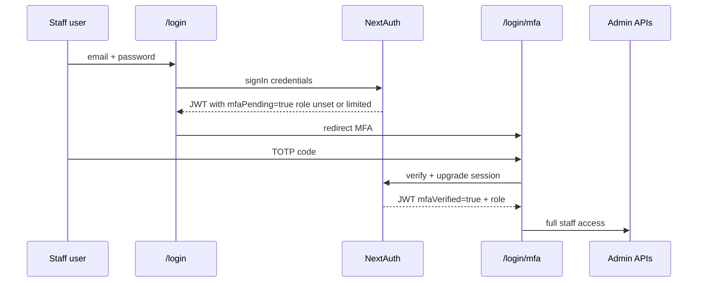

# Area 02 — Deep dive + fix plan

**Status:** plan-ready (awaiting permission to implement)  
**Priority:** P0 (after Area 01)  
**Scope:** Admin / credit_manager account takeover — MFA + session hardening  
**Out of scope this area:** PBKDF2 → argon2 (Area 04); service-role secrets (Area 03); CSP/XSS (Area 05)

---

## Why this area next

Area 01 closed the **anon API** hole. Remaining highest blast radius: a stolen or guessed **staff password** (or cookie) unlocks decrypted credit-funding PII, CRM, Stripe, dispute letters, and bulk email — with **no second factor**.

---

## Current state (code)

| Piece | Behavior | Risk |
|--------|----------|------|
| Login | Email + password only (`src/app/login/page.tsx` → `signIn('credentials')`) | Phish / weak password / offline hash crack → full staff access |
| Auth | NextAuth Credentials + JWT (`src/lib/auth.ts`) | No TOTP / WebAuthn |
| Session | `strategy: 'jwt'`, **no custom `maxAge`** (NextAuth default **30 days**) | Long-lived stolen cookie |
| Rate limit | 10 / 15 min per email (`rateLimitDurable`) | Helps brute force; useless after password leak |
| Middleware | Role gates pages; **no MFA claim** | Once JWT exists, `/admin/*` is open |
| APIs | `requireAdminSession` / staff helpers check role only | Same |
| Reset | 6-digit email code, hashed, rate-limited | Email OTP ≠ MFA for login |
| `seedAdmin()` | Runs on **every** successful authorize path | Unnecessary surface; keep env-gated and rare |

**Roles:** MFA must apply to `admin` and `credit_manager`. Clients stay password-only for this area (optional follow-up).

**Blast radius if staff session stolen:** credit-funding decrypt, CRM, Stripe admin, dispute reports, staff messaging, notifications blast.

---

## Recommended design

### Approach (fit this repo)

1. **TOTP** (Authenticator apps) — standard, no SMS cost/spoofing as primary.
2. **Two Credentials flows or one authorize with optional `totp`:**
   - Step A: password OK → issue **pending** session (`mfaPending: true`, no/limited role for admin routes).
   - Step B: verify TOTP (or backup code) → clear pending, set `mfaVerified: true`, full `role`.
3. **Enforce for staff:**
   - If staff and `totp_enabled = false` → force enrollment page before admin.
   - If staff and enabled → block admin until `mfaVerified`.
4. **Encrypt TOTP secret at rest** (reuse AES field encryption pattern from credit-funding, or dedicated `MFA_ENCRYPTION_KEY`).
5. **Backup codes:** hashed (same as reset tokens / password style), one-time use.

### Alternative rejected for v1

- **Email OTP as only 2FA** — weaker (email compromise = both factors); OK as recovery later.
- **WebAuthn-only** — better UX long-term; more UI/device complexity; can follow MFA v2.
- **Auth0/Clerk** — large platform change; out of band for this pass.

---

## Fix plan (implement after approval)

### Step 1 — Schema migration `025-staff-mfa.sql`

Add to `users` (nullable for clients):

- `totp_secret_encrypted` TEXT NULL  
- `totp_enabled` BOOLEAN NOT NULL DEFAULT false  
- `totp_backup_hashes` JSONB NULL  -- array of hashed one-time codes  
- `totp_verified_at` TIMESTAMPTZ NULL  

Enable RLS already in place (deny anon). Service role only.

### Step 2 — Libraries + crypto helpers

- Add `otpauth` or `otplib` + `qrcode` (server-side QR data URL for enrollment).
- `src/lib/mfa-totp.ts`: generate secret, verify window ±1, encrypt/decrypt secret, generate/verify backup codes.
- Do **not** return raw secret after enrollment completes.

### Step 3 — Auth / session changes (`src/lib/auth.ts`, `next-auth.d.ts`)

- JWT claims: `mfaPending`, `mfaVerified`, `role` (role only set or honored when verified for staff).
- On password success for staff with MFA enabled → pending session only.
- On password success for staff without MFA → pending + `mfaEnrollmentRequired` redirect.
- Clients: unchanged full session.
- Session `maxAge`: e.g. **8 hours** for staff (or global 12h / shorter for staff via claim + middleware).
- Cookies: `useSecureCookies` when HTTPS; `sameSite: 'lax'`.
- **`seedAdmin`:** remove from hot `authorize` path; one-shot setup/`SETUP_TOKEN` only (or first-boot gated).

### Step 4 — API routes

- `POST /api/auth/mfa/verify` — rate-limited; upgrades session (or second Credentials provider `mfa`).
- `POST /api/admin/mfa/setup/start` — staff session; returns otpauth URI / QR (enrollment).
- `POST /api/admin/mfa/setup/confirm` — enables MFA after successful code.
- `POST /api/admin/mfa/disable` — admin-only, requires current TOTP (prevent lockout abuse carefully).
- Gate: `requireAdminSession` / staff helpers reject if staff JWT not `mfaVerified` (401/403 with code `MFA_REQUIRED`).

### Step 5 — UI

- `/login` → after password, redirect staff to `/login/mfa`.
- `/login/mfa` — 6-digit TOTP (+ backup code link).
- `/admin/settings` (or `/admin/security`) — enroll / show remaining backup codes once / regenerate.
- Middleware: if token `mfaPending` or staff without verified MFA → only allow `/login`, `/login/mfa`, MFA setup routes.

### Step 6 — Recovery / ops

- Print one-time backup codes at enrollment (user must save).
- Document: lost MFA → another admin disables via `disable` with their MFA, or SQL runbook with service role (break-glass).
- After Area 01 password rotation, enroll MFA immediately for staff.

### Step 7 — Verify

- Staff password-only → cannot call `/api/admin/crm` (MFA_REQUIRED).
- Staff + TOTP → admin works.
- Client login unchanged.
- Rate limit MFA attempts (e.g. 5 / 15 min).
- `npm run diagnostic:prod` Phase 9 text updated: MFA implemented for staff.

---

## Implementation order when approved

1. Migration 025 + crypto helpers  
2. Auth JWT + login two-step + middleware  
3. Enrollment + verify APIs + UI  
4. Session maxAge / seedAdmin cleanup  
5. Tests / manual smoke + commit/push  

---

## Success criteria

- [ ] `admin` / `credit_manager` cannot use admin UI or admin APIs without MFA when enabled  
- [ ] New staff must enroll before full access  
- [ ] TOTP secret encrypted at rest; backup codes hashed  
- [ ] Stolen password alone is insufficient for staff  
- [ ] Clients unaffected  
- [ ] Staff session lifetime reduced from default 30d  

---

## Notes / trade-offs

- First staff login after deploy will force enrollment — coordinate with Mac + credit manager.  
- Existing long-lived JWTs expire or get invalidated on next jwt refresh when we require `mfaVerified` for staff (jwt callback can strip role until verified).  
- Area 04 (argon2) still recommended after MFA; do not block MFA on that.
