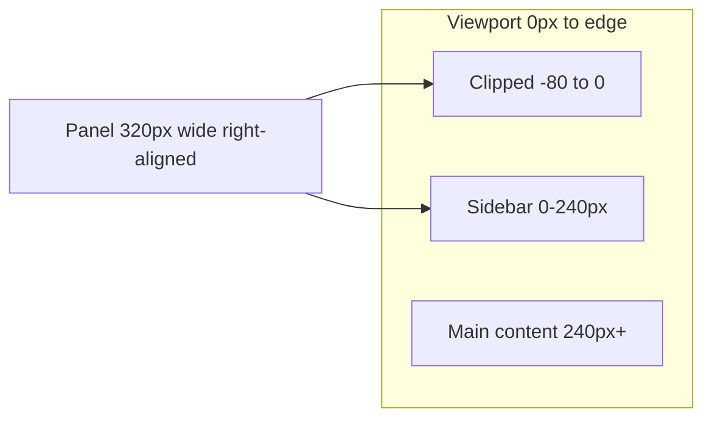

# Site-wide UI/UX Fix Plan

## Root cause: notification panel (P0)

The bell lives in the **240px sidebar header** ([`ClientSidebar.tsx`](src/components/dashboard/ClientSidebar.tsx)), but the dropdown in [`NotificationBell.tsx`](src/components/ui/NotificationBell.tsx) is **`w-80` (320px) + `absolute right-0`**:

```114:114:src/components/ui/NotificationBell.tsx
        <div className="absolute right-0 top-full mt-2 w-80 bg-white border border-brand-border rounded-xl shadow-lg z-50 max-h-96 overflow-hidden flex flex-col">
```

With `right-0`, the panel’s right edge aligns to the sidebar’s right edge (240px), so the panel spans **-80px → 240px** — the left ~80px is off-screen (matches your screenshot).



### Fix approach (robust)

Refactor [`NotificationBell.tsx`](src/components/ui/NotificationBell.tsx) to:

1. **Render the panel in a React portal** (`document.body`) so it is not constrained by sidebar width/stacking.
2. **Position with `fixed` coordinates** from the bell button’s `getBoundingClientRect()` on open/resize/scroll.
3. **Clamp horizontally** so the panel stays within `8px` of viewport edges.
4. **Prefer opening to the right** of the bell on desktop (into main content); on mobile (bell at top-left), anchor `left` with clamping.
5. Raise panel **`z-index` to `z-[70]`** (above sidebar `z-50` and mobile controls `z-[60]`).
6. **UX polish:** `Escape` closes panel; `line-clamp-2` on message text (replace single-line `truncate`); optional `aria-expanded` on the bell button.

Pass an optional `align?: 'start' | 'end'` prop from [`ClientSidebar.tsx`](src/components/dashboard/ClientSidebar.tsx) (`end` for sidebar desktop, `start` for mobile top-left cluster) — or derive automatically from measured space.

Also add `overflow-visible` on the sidebar header wrapper so any fallback absolute positioning is not clipped.

---

## Client dashboard UX (P1)

| Issue | File(s) | Fix |
|-------|---------|-----|
| Welcome shows raw email (`maccesar.inc@gmail.com`) | [`dashboard/page.tsx`](src/app/dashboard/page.tsx) | Prefer `client.name` from profile API; fallback helper that uses first name unless `name` looks like an email (use local-part) |
| Mobile content under fixed menu/bell | [`dashboard/layout.tsx`](src/app/dashboard/layout.tsx) | Add `pt-14 md:pt-0` (and optional `pl-0`) on `<main>` for mobile safe area |
| Thin/hard-to-see progress bar | [`dashboard/page.tsx`](src/app/dashboard/page.tsx) | Use `h-2.5`, brand token color class instead of inline hex |
| Duplicate nav icons (Credit & Funding + Billing both use card emoji) | [`ClientSidebar.tsx`](src/components/dashboard/ClientSidebar.tsx) | Change Billing icon to distinct glyph (e.g. receipt/wallet) |
| Help card excessive vertical padding | [`dashboard/page.tsx`](src/app/dashboard/page.tsx) | Tighten padding on mobile (`p-4 sm:p-5`) |

Add small shared helper: [`src/lib/display-name.ts`](src/lib/display-name.ts) — `getDisplayFirstName({ name?, email? })` reused on dashboard home and messages.

---

## Admin panel UX (P2)

Apply patterns already used in [`admin/credit-funding/page.tsx`](src/app/admin/credit-funding/page.tsx) across other admin list pages.

### Mobile safe area (all admin pages)

- [`AdminShell.tsx`](src/components/admin/AdminShell.tsx): add `pt-14 pl-12 md:pt-0 md:pl-0` on `<main>` so the fixed hamburger in [`AdminSidebar.tsx`](src/components/admin/AdminSidebar.tsx) does not overlap page titles/actions.

### Responsive tables (horizontal scroll + optional mobile cards)

Wrap tables in `overflow-x-auto` and keep desktop tables; add mobile card stacks where low effort:

- [`admin/clients/page.tsx`](src/app/admin/clients/page.tsx)
- [`admin/leads/page.tsx`](src/app/admin/leads/page.tsx)
- [`admin/crm/page.tsx`](src/app/admin/crm/page.tsx)
- [`admin/billing/page.tsx`](src/app/admin/billing/page.tsx)

### Fixed grid layouts that don’t stack on mobile

Change to `grid-cols-1 lg:grid-cols-[…]`:

- [`admin/competitors/page.tsx`](src/app/admin/competitors/page.tsx) — `grid-cols-[200px_1fr]`
- [`admin/packages/page.tsx`](src/app/admin/packages/page.tsx) — `grid-cols-[1fr_320px]`
- [`admin/revenue/page.tsx`](src/app/admin/revenue/page.tsx) — `grid-cols-[1fr_360px]`

### Admin messages split pane

- [`admin/messages/page.tsx`](src/app/admin/messages/page.tsx): replace always-on `grid-cols-[280px_1fr]` with `grid-cols-1 lg:grid-cols-[280px_1fr]`; on mobile show client list OR thread with back button.

### Pagination overflow

- [`admin/clients/page.tsx`](src/app/admin/clients/page.tsx), [`admin/leads/page.tsx`](src/app/admin/leads/page.tsx): on small screens show **Prev / Page X of Y / Next** instead of rendering every page number.

### Modal z-index consistency

Ensure modals/overlays (e.g. credit-funding invite modal, document preview) use **`z-[70]+`** so they sit above the mobile menu button (`z-[60]`).

---

## Public marketing UX (P3)

| Issue | File(s) | Fix |
|-------|---------|-----|
| Hash links break off homepage (`#contact` on `/credit-funding`) | [`Navbar.tsx`](src/components/Navbar.tsx), [`Footer.tsx`](src/components/Footer.tsx) | Use `/#services`, `/#contact`, etc. for section links |
| Mobile menu a11y gaps | [`Navbar.tsx`](src/components/Navbar.tsx) | `aria-expanded`, `aria-controls`, Escape to close, focus management |
| Hamburger touch target too small | [`Navbar.tsx`](src/components/Navbar.tsx) | `min-h-[44px] min-w-[44px]` |
| Homepage missing `<main>` landmark | [`app/page.tsx`](src/app/page.tsx) | Wrap content between Navbar and Footer in `<main id="main">` |
| CTA banner over-padded on mobile | [`CtaBanner.tsx`](src/components/CtaBanner.tsx) | Responsive `px-6 sm:px-10 lg:px-14` |

Optional polish: [`CreditFundingForm.tsx`](src/components/credit-funding/CreditFundingForm.tsx) step indicator — add visible “Step X of Y” (already partially present) and ensure horizontal step dots scroll with padding hint on small screens.

---

## Verification checklist

After implementation:

1. **Desktop dashboard:** open notifications from sidebar bell — panel fully visible, opens into main content, does not clip left.
2. **Mobile dashboard:** bell + hamburger do not cover page title; notification panel fits viewport.
3. **Admin mobile:** open Clients, Leads, Messages — no horizontal page overflow; tables scroll or stack.
4. **Marketing:** from `/credit-funding`, Footer/Navbar “Contact” goes to `/#contact` on homepage.
5. **Keyboard:** Escape closes notification panel and mobile nav menu.
6. Run `npm run build` and spot-check Lighthouse/a11y on homepage + dashboard.

---

## Implementation order

1. NotificationBell portal + positioning (unblocks primary bug)
2. Dashboard layout + welcome name + sidebar icons
3. AdminShell safe area + table scroll wrappers (batch similar files)
4. Admin messages + pagination + fixed grids
5. Marketing Navbar/Footer/main/CtaBanner
6. Build + manual smoke test on prod preview

No database migrations required for this work.
