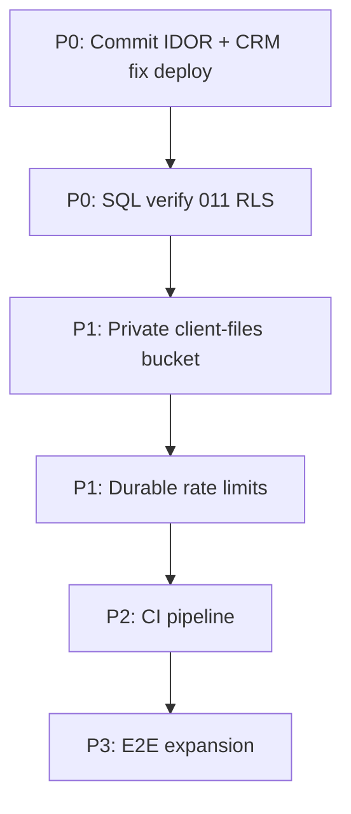

# Remediation Backlog

**Generated:** 2026-06-23  
**Source:** Full site diagnostic (Phases 0–8)

Effort scale: **S** (&lt;1 day), **M** (1–3 days), **L** (1–2 sprints)

---

## P0 — Before next production promotion

| ID | Item | Effort | Status | Owner action |
|----|------|--------|--------|--------------|
| P0-1 | Confirm migration **012** applied in Supabase | S | **DONE** | Prod probe: columns + `staff_shared` OK |
| P0-2 | Deploy/merge `cursor/admin-billing-plan-save` (workflow, preview, email fixes) | S | **VERIFY** | Prod shows `/credit-funding` + workflow API |
| P0-3 | Fix credit-funding messages IDOR | S | **DONE** | Ownership check in `messages/route.ts` |
| P0-4 | Verify migration **011** RLS enabled | S | **OPEN** | Run SQL in Supabase (service role can't probe) |
| P0-5 | Commit + deploy diagnostic fixes (IDOR, CRM null guard) | S | **OPEN** | Uncommitted local changes |

---

## P1 — Security hardening (1–2 sprints)

| ID | Item | Effort | Rationale |
|----|------|--------|-----------|
| P1-1 | Make `client-files` bucket **private**; signed URLs like credit-funding | M | S-H1: world-readable client vault |
| P1-2 | Durable rate limiting (Upstash Redis / Vercel KV) | M | S-M2: in-memory limits per instance |
| P1-3 | Magic-byte validation on client vault uploads | S | S-M5 |
| P1-4 | Upload session HMAC TTL (expiry in payload) | S | S-M4 |
| P1-5 | Rate limits on admin and dashboard mutation APIs | M | S-M3 |
| P1-6 | `admin/data` PATCH field whitelist | S | S-M6 |
| P1-7 | Upgrade nodemailer / address npm audit (careful with next-auth) | M | High CVEs in mail path |

---

## P2 — Reliability

| ID | Item | Effort | Rationale |
|----|------|--------|-----------|
| P2-1 | Credit intake transaction or orphan cleanup job | M | Partial failure leaves orphan apps |
| P2-2 | Extend diagnostic script for migration 011 RLS probe | S | Partially done; add explicit RLS check |
| P2-3 | GitHub Actions: lint + unit on PR | S | No CI today |
| P2-4 | NotificationBell defensive array parsing | S | Edge-case UI crash |
| P2-5 | Admin dashboard null-safe MRR aggregation | S | NaN risk on null price |

---

## P3 — Quality and compliance

| ID | Item | Effort | Rationale |
|----|------|--------|-----------|
| P3-1 | Playwright E2E: login, credit intake smoke, admin workflow | L | Only 2 smoke tests today |
| P3-2 | API integration tests for auth boundaries (56 routes) | L | Regression safety |
| P3-3 | Tighten CSP (remove `unsafe-eval` if possible) | M | S-L3 |
| P3-4 | Admin TOTP 2FA | L | S-L4 / compliance |
| P3-5 | Migrate password hashing to Argon2 | M | S-L5 |
| P3-6 | Document `SETUP_TOKEN` / `ADMIN_PASSWORD` in `.env.example` | S | S-L7 |
| P3-7 | Google Calendar API for real Meet links (replace placeholder) | M | Manual follow-up in diagnostic |

---

## Completed during diagnostic

| Item | File(s) |
|------|---------|
| Messages IDOR ownership check | `src/app/api/dashboard/credit-funding/messages/route.ts` |
| CRM null-safe search | `src/app/admin/crm/page.tsx` |
| Diagnostic script Phase 11 + migration 012 probes | `scripts/diagnostic-production.mjs` |
| Deliverables in `diagnostics/` | baseline, security, manual, edge-case, remediation |

---

## Suggested execution order

---

## Risk acceptance (document if deferred)

| Risk | Accept until |
|------|--------------|
| Public `client-files` bucket | P1-1 shipped |
| In-memory rate limits | P1-2 shipped |
| No 2FA | Explicit business sign-off |
| Service role as sole DB gate | Standard for this architecture; protect server secrets |
