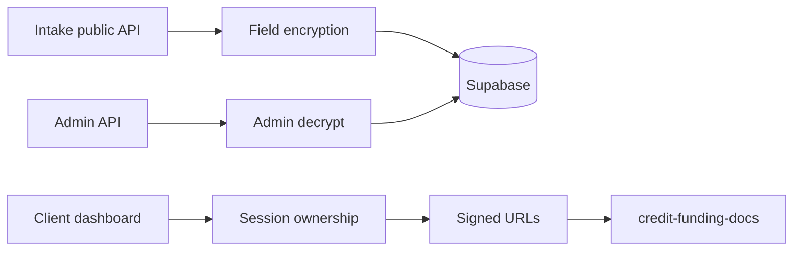

# Security Findings — API & Infrastructure Audit

**Generated:** 2026-06-23  
**Scope:** 56 API route handlers under `src/app/api/`

## Architecture note

- **Page middleware** ([`src/middleware.ts`](../src/middleware.ts)) protects `/admin/*` and `/dashboard/*` only.
- **`/api/*` is not middleware-protected.** Each route must enforce auth independently.
- **Database access** uses `SUPABASE_SERVICE_ROLE_KEY` exclusively — RLS is defense-in-depth.

---

## API authorization matrix

### Public / token-gated

| Route | Auth | Rate limit | Notes |
|-------|------|------------|-------|
| `POST /api/contact` | None | 3/15min IP | Input length caps |
| `POST /api/credit-funding/intake` | None + HTTPS prod | 3/hr IP | HMAC upload session optional |
| `POST /api/credit-funding/session` | None + HTTPS | 20/hr IP | Issues upload tokens |
| `POST /api/credit-funding/stage` | HMAC session | 30/hr IP | Staged file upload |
| `POST /api/auth/forgot-password` | None | IP + email | Enumeration-safe |
| `POST /api/auth/reset-password` | None | IP + email + code | |
| `GET/POST /api/auth/[...nextauth]` | NextAuth | Login 10/15min | Credentials only |
| `POST /api/setup` | `SETUP_TOKEN` | 3/15min IP | Disabled if token unset |
| `POST /api/stripe/webhook` | Stripe signature | None | Idempotent events table |

### Admin (`requireAdminSession`)

All routes under `src/app/api/admin/**` use [`requireAdminSession()`](../src/lib/stripe-admin-auth.ts) — **verified via grep on 56 routes.**

Includes: CRM, credit-funding (+ workflow, export), clients, leads, files, tasks, meetings, billing admin, Stripe admin, activity, data, approvals, messages, onboarding, reports.

**Production probe:** `/api/admin/crm`, `/api/admin/credit-funding` → **401** without session.

### Dashboard (`getServerSession`)

| Route | Role check | IDOR / ownership |
|-------|------------|------------------|
| `GET/POST /api/dashboard/credit-funding` | Session | Email + user_id match |
| `POST /api/dashboard/credit-funding/upload` | Session | Email + user_id match |
| `GET/POST /api/dashboard/credit-funding/messages` | Session | **Fixed:** email + user_id match |
| `GET/POST /api/dashboard/files` | Client only | Delete checks file owner |
| `GET/PATCH /api/dashboard/approvals` | Client only | IDOR on patch |
| `GET/POST /api/dashboard/messages` | Client only | clientId scoped |
| `GET /api/dashboard/meetings` | Client + clientId | |
| `GET/PUT /api/dashboard/notifications` | Any session | PUT checks notification user_id |
| `GET/PUT /api/dashboard/settings` | Any session | Password rate limit |
| `GET /api/dashboard/activity` | Client or **admin** | Admin sees all activity via API |

### Billing (`authorizeBillingClient`)

| Route | Admin | Client |
|-------|-------|--------|
| subscribe, change-plan, cancel | Yes (with clientId) | No |
| save-card, setup-intent | No | Yes (own clientId) |
| payment-methods | Yes/No | Scoped to clientId |

---

## Severity-ranked findings

### High

| ID | Finding | Location | Status |
|----|---------|----------|--------|
| S-H1 | **`client-files` storage bucket is public** — anyone with URL can read objects | `supabase-migration-006`, `client-files-storage.ts` | Open |
| S-H2 | Service role is sole DB gate — server compromise = full data access | `src/lib/supabase.ts` | Accepted risk; harden server |

### Medium

| ID | Finding | Location | Status |
|----|---------|----------|--------|
| S-M1 | Credit funding messages missing ownership check | `dashboard/credit-funding/messages/route.ts` | **Fixed this session** |
| S-M2 | In-memory rate limits don't work across Vercel instances | `rate-limit.ts` | Open |
| S-M3 | No rate limits on admin/billing/dashboard APIs | Most admin routes | Open |
| S-M4 | Upload session HMAC tokens don't expire | `credit-funding-upload-session.ts` | Open |
| S-M5 | Client vault uploads lack magic-byte validation | `client-files-storage.ts` | Open |
| S-M6 | `admin/data` PATCH has no field whitelist | `admin/data/route.ts` | Open |
| S-M7 | `supabase-schema.sql` RLS policies use `USING (true)` on core tables | Legacy migration | Low risk while anon key unused |

### Low

| ID | Finding | Location |
|----|---------|----------|
| S-L1 | No CSRF tokens (mitigated by SameSite cookies) | All cookie-auth POSTs |
| S-L2 | Admin can call `/api/dashboard/activity` without `requireAdminSession` | `dashboard/activity/route.ts` |
| S-L3 | CSP allows `unsafe-inline` / `unsafe-eval` | `next.config.js` |
| S-L4 | No 2FA for admin | `auth.ts` |
| S-L5 | PBKDF2 10k iterations (not Argon2) | `db.ts` |
| S-L6 | Dev encryption key fallback when env unset | `field-encryption.ts` |
| S-L7 | `SETUP_TOKEN` / `ADMIN_PASSWORD` not in `.env.example` | Docs gap |

---

## Positive controls verified

- Credit funding PII encrypted at rest (AES-256-GCM); production sample ciphertext confirmed
- `credit-funding-docs` bucket private; signed URLs only
- Credit funding file magic-byte + executable heuristic scan
- Stripe webhook signature + idempotency table
- Security headers on production (HSTS, CSP, X-Frame-Options, nosniff) — **4/4**
- Forgot-password anti-enumeration
- Admin APIs return 401 unauthenticated (production probe)
- Portal/admin pages redirect to login (307)

---

## Data flow (credit funding)

